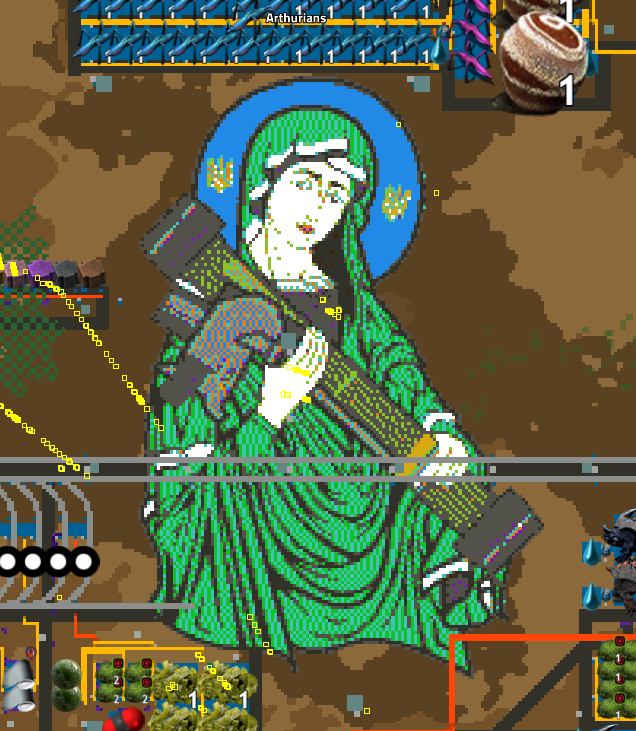
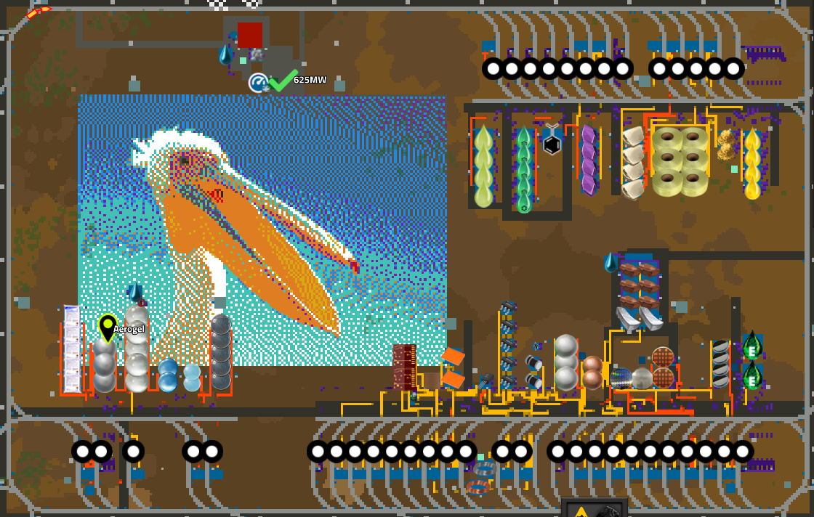
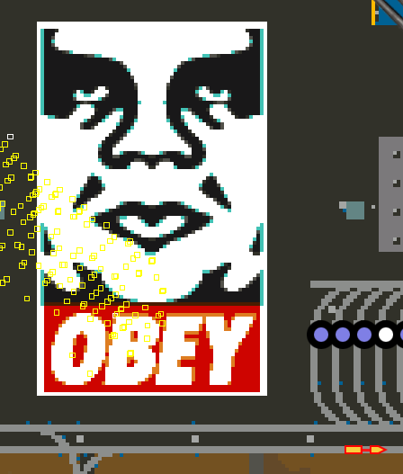
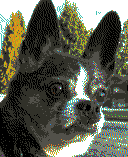
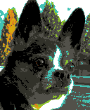

# Image2Blueprint





Image2Blueprint converts basic bitmaps into Factorio blueprints.
v1 is designed to work with Pyanadons multi-color refined concrete, white lime tile, and brick path.

Run it from the command line like so:

```bash
java -jar Image2Blueprint.jar -d input.png
```

Where
- `-q` run in quiet mode.  Only the final blueprint string will be printed to stdout.
- `-d` is an optional flag to enable dithering.  
- `input.png` is the path to the input image file.  It must be the last parameter.

### Input

The input image should be a any image file ImageIO can read.  
This includes **PNG, JPEG, BMP, GIF, PIO,** and **WEBP** files.

I strongly recommend smashing your image down to only a few chunks.  the examples provided
are often 4 chunks wide (128 pixels).

### Output 
The text output will be to stdout. Redirect it to a file like so:

```bash
java -jar Image2Blueprint-1.0-SNAPSHOT.jar [-d] input.png > output.txt
```

The output file will contain a Factorio blueprint string.  You can import this string into Factorio by copying it to your clipboard and using the import function in the blueprint library.

There will also be an `after.png` file created in the working directory.  
This is a preview of what the blueprint will look like in Factorio.

### Colors

Yes, transparent pixels are supported.  Any pixel more than 50% transparent will be ignored from the results.

Image conversion is limited to the colors of refined concrete.  The amount of error can be reduced with dithering, but 
the colors will still be limited to the 16 colors of refined concrete.
The dither algorithm is based on Floyd-Steinberg dithering.
It does not take into account the ground under your blueprint.





Before, with dithering, without dithering.

### Javascript

A live javascript version of this project is available at ./tree/master/src/mian/javascript/index.html